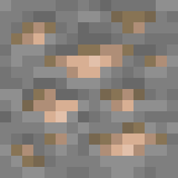
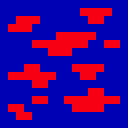
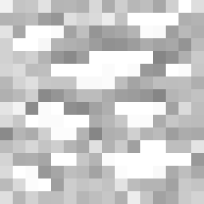

[!badge variant="success" text="Author: 0x4a4b"]


# 1.2 Minecraft RTX PBR Texturing Guide


## Introduction

Welcome to the comprehensive guide on creating Physically Based Rendering (PBR) textures for Minecraft with RTX! With the introduction of RTX, Minecraft has taken a significant leap in visual fidelity, allowing players to experience stunning graphics with realistic lighting, shadows, and reflections. This guide aims to walk you through the process of creating and implementing PBR textures, enhancing the visual appeal of your Minecraft world.


In Minecraft with RTX, textures are no longer just simple images; they now incorporate various maps that define how surfaces interact with light. These textures include not only the base color but also detailed information about metallic properties, surface roughness, normal details, height variations, and emissive properties. By leveraging these PBR textures, you can create incredibly realistic materials, from shiny metals and rough stones to glowing ores and intricate terrains.

Throughout this guide, you will learn about the different types of PBR texture maps, how to create and combine them, and how to pack them efficiently for use in Minecraft. We'll start with the basics of PBR texturing, move on to the creation of each specific map, and finally, we'll show you how to implement these textures in the game.

Whether you're a seasoned texture artist or a newcomer looking to enhance your Minecraft creations, this guide will provide you with the knowledge and tools needed to take full advantage of RTX capabilities. Get ready to transform your Minecraft experience with breathtaking visuals and detailed textures!


### How to Create RTX Texture Packs for Minecraft

**Tools Needed**

1. **Photo Editing Software**:
   - Adobe Photoshop
   - GIMP
   - Paint.net
   - Pixlr.com

2. **Minecraft Bedrock Edition**
3. **NVIDIA RTX GPU (NVIDIA GeForce® RTX 20 Series and higher, and AMD Radeon RX 6000 Series and higher.)**

**Texture Map Basics**

In Minecraft with RTX, textures use six different maps packed into three texture files:

1. **Base Color and Opacity**
2. **Metallic, Emissive, and Roughness**
3. **Normal or Height Map**

### Step-by-Step Guide

#### 1. **Create Base Color and Opacity Map**

- **Base Color Map**: This is the main texture and is stored in the RGB channels of the texture file.
- **Opacity Map**: Defines transparency and is stored in the alpha channel (only needed if the texture has transparency).

**Example: iron_ore.png**


- **RGB Channels**: Base color
- **Alpha Channel**: Opacity (if needed)

[!ref Bedrock Samples](https://github.com/Mojang/bedrock-samples/releases)

Get `iron_ore.png` from bedroc samples pack by Mojang.

#### 2. **Create Metallic, Emissive, and Roughness Maps**

- **Metallic Map**: Defines which parts of the texture are metallic (0 for non-metallic, 1 for metallic).
- **Emissive Map**: Defines how much a part of the texture glows (0 for no glow, 1 for full glow).
- **Roughness Map**: Defines how rough the texture is (0 for smooth, 1 for rough).

### Steps to Create an MER Map in GIMP

1. **Open Your Base Texture**:
   - Start by opening your base texture image in GIMP.

2. **Access the Channels Tab**:
   - Navigate to the Channels tab (`Windows > Dockable Dialogs > Channels`). This tab displays the individual color channels: Red, Green, and Blue.

3. **Creating the Metallic Map (Red Channel)**:
   - **Select the Red Channel**: Click on the Red channel to select it. Make sure the Green and Blue channels are deselected, which means you are now editing only the Red channel.
   - **Paint the Metallic Map**: Use the pencil tool to draw on the image. Painting in shades of gray will set the metallic properties:
     - Black (0) for non-metallic areas.
     - White (1) for fully metallic areas.
     - Shades of gray for partial metallic effects.

4. **Creating the Emissive Map (Green Channel)**:
   - **Select the Green Channel**: Click on the Green channel, making sure the Red and Blue channels are deselected.
   - **Paint the Emissive Map**: Use the pencil tool to draw emissive properties:
     - Black (0) for non-glowing areas.
     - White (1) for fully glowing areas.
     - Shades of gray for varying levels of glow.

5. **Creating the Roughness Map (Blue Channel)**:
   - **Select the Blue Channel**: Click on the Blue channel, deselecting the Red and Green channels.
   - **Paint the Roughness Map**: Use the pencil tool to indicate surface roughness:
     - Black (0) for smooth surfaces.
     - White (1) for rough surfaces.
     - Shades of gray for intermediate roughness.

6. **Review and Save the MER Map**:
   - **Review**: Enable all three channels to view the combined MER map. This will show how the different properties interact.
   - **Save the Image**: Save the image with a descriptive name, such as `texture_mer.png`.

!!!info Tips
- **Brush Size and Opacity**: Adjust the pencil tool's size and opacity to control the precision and intensity of your edits.
- **Zoom In**: Zoom in for more precise editing, especially on detailed textures.
- **Layer Management**: Keep a backup of your original texture and individual maps in separate files or layers for easy adjustments later.
!!!





**Example: iron_ore_mer.png**
- **Red Channel**: Metallic map
- **Green Channel**: Emissive map
- **Blue Channel**: Roughness map
- **Alpha Channel**: Not used

Save the file as `iron_ore_mer.png`.

#### 3. **Create Height Map**

<!-- - **Normal Map**: Simulates bumps and dents. -->
- **Height Map**: Similar to normal maps but specifically for pixelated textures (like Minecraft’s 16x16 textures).


### Creating a Height Map in GIMP

1. **Open Your Base Texture**:
   - Open the texture image you want to create a height map for in GIMP.

2. **Prepare the Height Map**:
   - You can start with either a grayscale image or convert your existing texture.

3. **Using the Pencil Tool**:
   - **Select the Pencil Tool**: In the toolbox, select the pencil tool for precise control over individual pixels.
   - **Set Foreground Color**: Set the foreground color to a shade of gray corresponding to the desired height:
     - **Black (0)**: Represents the lowest point.
     - **White (1)**: Represents the highest point.
     - **Gray**: Represents intermediate heights.
   - **Shade the Image**: Use the pencil tool to draw on the image, shading areas according to the height information you want to convey.

4. **Using Desaturate**:
   - **Convert to Grayscale**: If your texture is colored, you can desaturate it to remove color while retaining luminance information:
     - Go to `Colors > Desaturate` and select an option that best captures the depth information (e.g., Lightness, Luminosity).
   - **Adjust Brightness and Contrast**: Fine-tune the resulting grayscale image using `Colors > Brightness-Contrast` to emphasize the height differences.
   - **Convert to Grayscale for Height Map**: Another method is `Colors > Desaturate > Color to Gray`, which can help in graying out the image while emphasizing height variations.

5. **Review and Save**:
   - **Check the Map**: Ensure that the height variations are correctly represented.
   - **Save the Image**: Save your height map as `_height.png`.
!!!info Tips:
- **Detail Work**: Use smaller brush sizes for detailed areas.
- **Layer Duplicates**: Work on a duplicate layer to preserve the original image.
- **Use Gradients**: For smooth transitions, consider using gradient tools to create more natural height changes.
!!!


<!-- **Example: iron_ore_normal.png**
- **RGB Channels**: Normal map (or Height map if specified) -->



Save the file as `iron_ore_height.png`.


#### 4. **Create Normal Map**

[!ref Creating Normal Map](./1.4-creating-normal-map.md)

### Packing Maps into Files

1. **iron_ore.png**: Contains base color and optional opacity.
2. **iron_ore_mer.png**: Contains metallic, emissive, and roughness.
3. **iron_ore_height.png**: Contains height map.

### Pointing Texture Maps to Color Map with texture_set.json file

- `texture_set.json` file helps to point the `iron_ore_mer.png` and `iron_ore_height.png` or `iron_ore_normal.png` to `iron_ore.png`
- without `texture_set.json` we can't see the texture map outputs

[!ref Texture Sets](./1.3-texture_set-file)

### Testing Your Textures

1. **Import Textures into Minecraft**:
   - Create a new resource pack folder in the `development_resource_packs` directory.
   - Add your texture files to the appropriate folders (e.g., `textures/blocks`).

2. **Load Resource Pack in Minecraft**:
   - Open Minecraft and enable your resource pack in the settings.
   - Ensure you have an RTX capable GPU and enable RTX from the video settings.

### Example Texture Pack Structure

```
development_resource_packs/
    your_texture_pack/
        textures/
            blocks/
                iron_ore.png
                iron_ore_mer.png
                iron_ore_height.png
```

### In-Game Output

### Tutorial Pack

[!file Tutorial Pack](./pbr-guide-img/tutorial_pack.zip)

With these steps, you can create RTX textures for Minecraft, enhancing the visual appeal of your game with realistic materials and lighting. Experiment with different textures and settings to achieve the desired effect.


